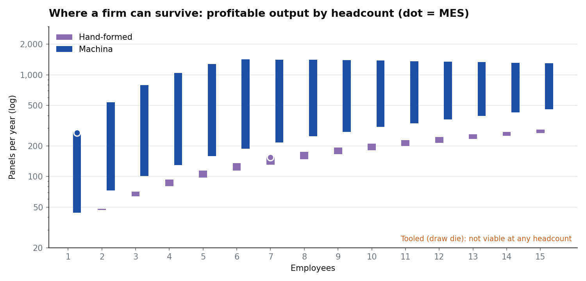
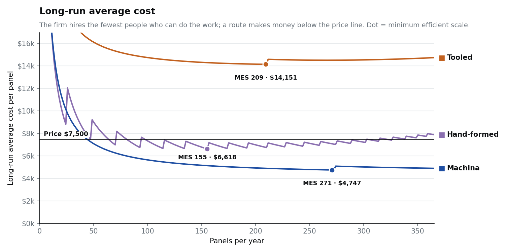
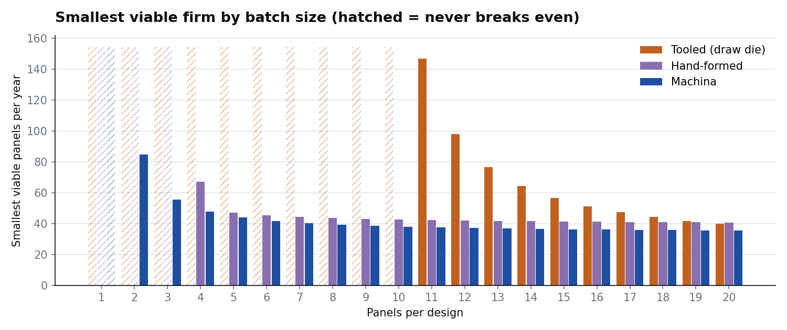

# machina-industrial-scale-enablement

**Live model:** `https://benh83.github.io/machina-industrial-scale-enablement/`
 

## The question

How does dieless robotic sheet-metal forming (Machina Labs' RoboCraftsman) change the size of custom metal-fabrication firm that can break even, and be efficient? Firm size is measured two ways: **employees** and **units produced per year**.

> _[YOUR FRAMING: why firm size is the right lens. For example, minimum efficient scale, entry barriers, and what happens to market structure when a per-design fixed cost disappears.]_

## Test case

The test product is a custom **doubly curved aluminum facade or canopy panel**:

- 4 × 10 ft, 3 mm 5052 aluminum, PVDF-coated.
- Sold at **$7,500** per panel, about $2,080 per m².
- Every order is a new geometry. Each geometry sells **5 panels** by default (slider: 1–25).

Doubly curved panels are the right test because they can't be made on a press brake or roll former: the surface bends in two directions at once, like a saddle or a dome. Without Machina, the options are a die, a form built for that geometry, or many skilled hours.

> _[YOUR NOTE: why architectural facades rather than defense. For example, no ITAR, no AS9100, no FAA, so a small firm can actually enter.]_

The model compares three ways to make each geometry:

| Route | What the firm does | Where the forming cost shows up |
|---|---|---|
| **Tooled** | Buys a draw die for each geometry, then pays a host shop to press the panels | Per design (the die) |
| **Hand-formed** | Its own employees form each panel over a CNC-milled buck | Headcount (about 60 hours per panel) |
| **Machina** | Designs, sells and manages the job; Machina forms, scans and trims the panels | Per panel (robot time) plus a small per-design programming fee |

## Headline results (default assumptions)

Scenario 1 ships parts from Machina's Los Angeles factory. Scenario 2 assumes a hypothetical regional Machina factory 150 miles away.

| Scenario | Route | Smallest viable firm | Minimum efficient scale (MES) | Near-efficient range (within 5% of lowest cost) | Lowest avg cost | Panels per employee-year | Quote win rate |
|---|---|---|---|---|---|---|---|
| 1 | Tooled | **Never viable** | 209 panels, 1 emp | 93–386 panels | $14,151 | 211 | 19% |
| 1 | Hand-formed | **47 panels, 2 emp** | 155 panels, 7 emp | 71–259 panels, 3–13 emp | $6,618 | 24 | 29% |
| 1 | Machina | **44 panels, 1 emp** | 271 panels, 1 emp | 188–670 panels, 1–3 emp | $4,747 | 273 | 38% |
| 2 | Tooled | **Never viable** | 193 panels, 1 emp | 91–369 panels | $14,299 | 194 | 18% |
| 2 | Hand-formed | **47 panels, 2 emp** | 155 panels, 7 emp | 71–259 panels, 3–13 emp | $6,618 | 24 | 29% |
| 2 | Machina | **35 panels, 1 emp** | 314 panels, 1 emp | 218–622 panels, 1–2 emp | $3,880 | 316 | 41% |

"Smallest viable firm" is the lowest output, and the headcount at that output, where price covers long-run average cost. MES is the output with the lowest long-run average cost. Tooled has an MES but never gets its cost below the $7,500 price.







## What the numbers say

Each finding is stated as a fact from the model, followed by space for your interpretation.

**1. At 1–10 panels per design, dies aren't really Machina's competitor.**
With defaults, a die route costs **$60,162 per design**: a $45k die plus engineering, tryout, expected rework, storage, inspection, setup and financing. That's about **$12,000 per panel** at 5 panels per design, well above the $7,500 price. The die route only breaks even once each design repeats **11+ times** (147 panels a year at 11 per design). The real incumbent for bespoke work at this scale is skilled hand forming.

> _[YOUR ANALYSIS]_

**2. Machina lowers the smallest viable firm to one person.**
The smallest viable Machina firm is **1 employee selling 44 panels a year** (8.8 designs), or 35 panels with a regional factory. Hand forming needs **2 employees and 47 panels**. The barrier to entry falls modestly in units, but most of the change is in headcount.

> _[YOUR ANALYSIS]_

**3. The biggest effect is on output per employee, not tooling.**
All-in labor per panel is **6.8 hours for Machina versus 75.9 for hand forming**. That's **273 vs. 24 panels per employee-year, about 11×**. For the hand route, output grows only by hiring craftspeople. For the Machina route, the firm is mainly design, sales and project management, and output grows without adding people.

> _[YOUR ANALYSIS: this is the industrial-organization core. For example, headcount stops being a measure of capacity, and a one-person firm can be efficient.]_

**4. The efficient firm shrinks in headcount and grows in output.**

| Route | MES | Near-efficient range |
|---|---|---|
| Hand-formed | 155 panels with **7 employees** | 3–13 employees |
| Machina | 271 panels with **1 employee** | 1–3 employees, up to 670 panels |

Lowest average cost falls **28%** ($6,618 → $4,747). With a regional factory it falls **41%** ($3,880).

> _[YOUR ANALYSIS]_

**5. Distance to the Machina factory matters less than expected.**
Going from 1,800 miles to 150 miles lowers the smallest viable Machina firm only from 44 to 35 panels a year. Machina already beats hand forming even when parts are shipped cross-country and crated.

> _[YOUR ANALYSIS: what this implies for Machina's plans for distributed factories]_

**6. With Machina, the market limits growth, not the technology.**

- The largest profitable Machina firm makes about **1,430 panels with 6 employees**.
- Past that, winning more work in a thin regional market costs more than the work earns.
- Profit peaks at about 940 panels with 4 employees.
- Treat the profit levels with caution: price is held fixed, and a real market would compete it down.

> _[YOUR ANALYSIS]_

## Checking the claim that Machina "replaces stamping dies"

The model tests this by asking what incumbent process would otherwise make each kind of part Machina has made publicly.

| Machina part | What would otherwise make it | Holds up? |
|---|---|---|
| Custom body panels for OEMs (Ford F-150 Lightning demo, Toyota partnership) | Transfer-press lines with draw, trim and flange dies, often **$0.5–1M+** per panel family | **Yes for customization and low volume.** At mass-production volume, stamping still wins. |
| Air Force sustainment parts (Warner Robins) | Original tooling, often lost or worn out; hand forming; long supplier lead times | **Yes.** The Air Force reports parts **six months faster and three times more affordable**. |
| NASA toroidal tank | Dedicated forming tools or welded segments | **Yes.** Formed without molds, dies or specialized tooling. |
| Doubly curved facade panels (this model) | At large scale: stretch or multipoint forming (Dongdaemun Design Plaza, 22,000 panels, **$260/m²** after 3 years of R&D). At small scale: **hand forming**. Die casting ($7,000/m²) and hydroforming ($3,000/m²) are far more expensive. | **Only partly.** At 1–10 panels per design, Machina mostly replaces skilled hand labor, not dies. |

Verdict: Machina does replace dedicated hard tooling, but the pasted claim overstates it in two ways:

- **It doesn't replace high-volume stamping.** Machina's own automotive work targets customization and low volume.
- **"Implemented instantly" is too strong.** A design change still needs reprogramming, a first article, and roughly a week to first parts.

> _[YOUR ANALYSIS]_

## Key assumptions

All values are **synthetic**: plausible, and meant to be argued with. The full list with ranges is in [`assumptions.csv`](assumptions.csv). Machina publishes no pricing, so every Machina cost below is an assumption.

| Assumption | Default | Basis |
|---|---|---|
| Price per panel | $7,500 | About $2,080/m² for bespoke doubly curved aluminum, supplied only |
| Panels per design | 5 | Freeform facades often run 1–6 panels per geometry |
| Cost per employee (fully loaded) | $85,000 + $9,000 per-head overhead | One blended rate |
| Productive hours per employee | 1,850 / yr | |
| Coordination loss | 1.5% of hours per additional coworker | Organizational diseconomy of scale |
| Draw die per geometry | $45,000 (+$5k engineering, +$4k tryout) | Soft dies $20–60k, hardened $100k+ |
| Hand-forming hours per panel | 60 hr, plus 15% rework | Coachbuilders: 40–100+ hr for a hood-sized panel |
| CNC-milled buck per geometry | $3,500 | |
| Machina programming / first article | $3,500 per geometry | **Synthetic** |
| Machina robot time | 5 hr × $300/hr per panel | **Synthetic** |
| Machina surface finishing | $180 per panel | Stated finish 125 µin Ra |
| Lead time: tooled / hand / Machina | 10 / 5 / 2 wk (Machina 1 wk in scenario 2) | Machina: first parts typically within a week |
| Win rate halves every | 8 weeks of lead time | Construction schedules punish slow suppliers |
| Local market depth | 200 leads/yr before lead cost doubles | Thin regional market for bespoke facades |

> _[YOUR NOTE: which assumptions you'd most like an expert to challenge.]_

## Method

**Notation:**
- `Q` = panels per year, `n` = panels per design, `D = Q/n` = designs per year.
- `w` = quote win rate, which falls with lead time. `L = D/w` = qualified leads needed.
- `N` = employees, owner included.

```
hours(Q)    = L·h_quote + D·h_design + Q·h_unit
capacity(N) = N · h_year · (1 − m·(N−1))
TC(Q, N)    = N·(salary + overhead per head) + fixed + D·c_design + Q·c_unit + lead cost(L)
              feasible only if hours(Q) ≤ capacity(N)        (no contractors)

Short run: N fixed.        AC = TC/Q,  MC = dTC/dQ
Long run:  N*(Q) = fewest employees that can do the hours
           LRAC(Q) = TC(Q, N*(Q)) / Q
           MES = argmin LRAC;  smallest viable firm = min Q with price ≥ LRAC
```

Long-run average cost jumps at each hire because headcount comes in whole people. It rises at large scale for two reasons: coordination loss as the team grows, and a thin regional market in which each extra lead costs more than the last.

## Limitations

- Price is held fixed. In reality competition, or wider adoption of the technology, would push it toward the lowest average cost.
- There is one blended wage. Skilled panel formers are scarce and would cost more, which would make the hand-formed route look worse.
- Machina's capacity limits and job-queue priority (it also serves defense customers) aren't modeled.
- Installation, warranty, taxes and working-capital limits beyond per-design financing are excluded.

> _[YOUR NOTE: what you'd model next.]_

## Running it

- **In the browser:** `index.html` runs `model.py` itself, via [Pyodide](https://pyodide.org). The first load takes a few seconds.
- **Locally:** run `python -m http.server`, then open `http://localhost:8000`.
- **From the command line:** `python model.py` prints the results table. `python model.py --json` prints the full output. `python model.py --csv` rewrites `assumptions.csv`.
- **Figures:** `python make_figures.py` (needs matplotlib) regenerates `figures/`.
- **After editing `model.py`:** run `python build.py` to refresh the copy embedded in `index.html`, which is used when the page is opened as a local file.

## Sources

- [Machina Labs: Capabilities](https://machinalabs.ai/capabilities)
- [Machina Labs: Automotive](https://machinalabs.ai/applications/automotive)
- [Machina Labs: NASA toroidal tank case study](https://machinalabs.ai/resources/nasa-toroidal-tank-case-study)
- [Business Wire: Machina Labs raises $124 million (Feb 2026)](https://www.businesswire.com/news/home/20260204756837/en/Machina-Labs-Raises-$124-Million-to-Scale-Manufacturing-Infrastructure-for-Defense-and-Advanced-Mobility)
- [Defense One: the Air Force and Machina parts replacement](https://www.defenseone.com/technology/2024/04/air-force-help-startup-quietly-revolutionizing-parts-replacement/395430/)
- [Dongdaemun Design Plaza double-curved panel study](https://wyzrs.com/post/journal-paper)
- [Shao-Yi: automotive stamping die costs, body-panel lines $0.5–1M+](https://www.shao-yi.com/cost-of-automotive-stamping-dies)
- [Jennison: stamping die costs](https://www.jennisoncorp.com/post/sheet-metal-stamping-costs-explained-what-really-drives-the-price)
- [DRA Metal: hidden tooling costs](https://drametal.com/blog/sheet-metal-tooling-cost-guide/)

---

_Independent analysis. Not affiliated with or endorsed by Machina Labs. RoboCraftsman is a trademark of its owner._
